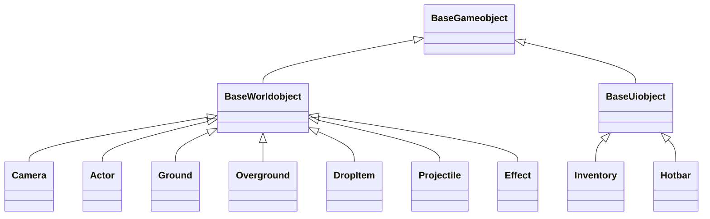
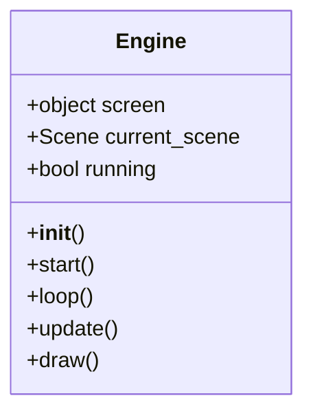
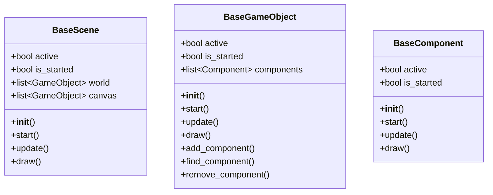

# クラス図

このドキュメントは、フレームワークの主要なクラスとその関係を Mermaid クラス図で説明します。ゲーム開発におけるアーキテクチャの理解に役立ててください。

## ゲームオブジェクトの継承関係

以下の図は、ゲームオブジェクトの継承階層を示しています。BaseGameobject を基に、ワールドオブジェクトと UI オブジェクトが分かれています。

## エンジンの詳細

Engine クラスはゲームのメインループを管理します。以下の図は Engine の主要な属性とメソッドを示しています。

## ベースクラスの詳細

BaseScene, BaseGameObject, BaseComponent はフレームワークの基盤となるクラスです。これらのクラスはゲームの構造を定義します。

